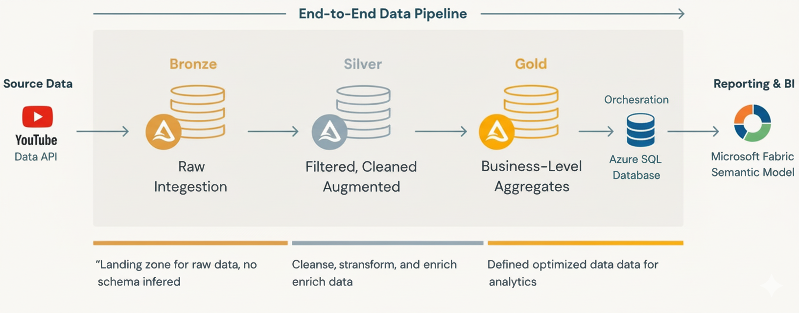

# YouTube Analytics Data Engineering Project

This project demonstrates an end-to-end data engineering pipeline using YouTube API v3, Azure Data Factory, Databricks, SQL Database, and Microsoft Fabric.
Data is ingested from YouTube API, processed with Medallion Architecture (Bronze → Silver → Gold) in Databricks, and finally visualized in Fabric Power BI reports.

🔹 Data Ingestion

Collected data using YouTube Data API v3 (Channel: T-Series).
Stored raw JSON/CSV files in Azure Blob Storage (Bronze layer).
Ingested data includes video details, statistics (views, likes, comments), and publishing dates.

🔹 Data Transformation (Databricks)

Implemented Medallion Architecture:
Bronze: Raw ingested data.
Silver: Cleaned and deduplicated data.
Gold: Aggregated and transformed data for analysis.

Applied PySpark transformations:
Filtering unnecessary or incomplete data.
Deduplication and error handling.
Calculating metrics like top trending videos, engagement ratios, and average views per day.
Created feature tables ready for analytics and reporting.

🔹 Data Movement

Used Azure Data Factory (ADF) to copy Gold tables from Databricks → Azure SQL Database.
Scheduled pipelines for incremental loading to keep the SQL DB up-to-date.

🔹 Data Modeling

Built Fabric Semantic Model on top of SQL DB Gold tables.
Applied final cleaning and transformations to prepare datasets for reporting.
Defined measures and dimensions such as:
Total views, likes, comments
Engagement per video
Publishing trends over time

🔹 Visualization

Created Power BI reports in Microsoft Fabric:
YouTube engagement distribution by published date, likes, comments, views.
Top trending videos dashboard.
Audience engagement insights (likes-to-views ratio, comment-to-view ratio).
Enabled interactive filters and visualizations for dynamic analysis.

🔹 Key Takeaways

Successfully built a scalable ETL pipeline from API ingestion to business reporting.
Leveraged PySpark for large-scale data transformations.
Demonstrated Medallion Architecture best practices in Databricks.
Gained actionable insights on YouTube channel performance.